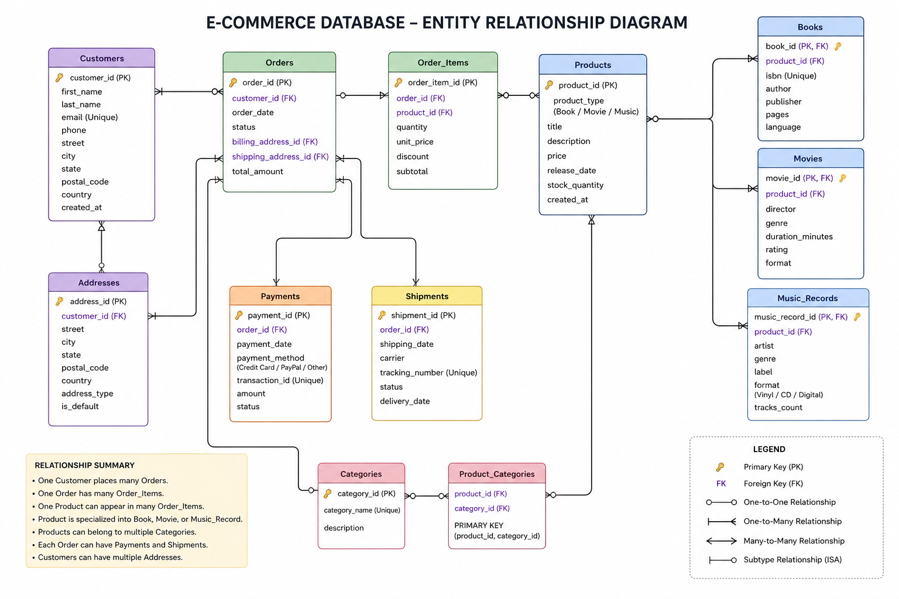

# E-Commerce Database Management System with SQL

## Project Overview

This project was completed for Harvard University's CS50 Introduction to Databases with SQL course in 2023. It involves the design and implementation of a relational database management system for an e-commerce platform that sells books, movies, and music records.

The database was developed using SQL and demonstrates key database concepts including schema design, normalization, data integrity, relational modeling, and business analytics reporting.

---

## Business Problem

E-commerce businesses generate large volumes of transactional and customer data that must be efficiently stored, managed, and analyzed.

This project provides a structured database solution for managing:

* Customer information
* Product inventory
* Orders and payments
* Delivery operations
* Employee records
* Customer feedback

The goal is to support business operations and generate actionable insights through SQL queries.

---

## Entity-Relationship Diagram

The following ER diagram illustrates the database schema and relationships between entities.

## Database Schema

The database consists of the following tables:

### Customers

Stores customer information including names, contact details, and location.

### Products

Stores product details such as title, category, genre, and pricing.

### Orders

Tracks customer purchases and payment methods.

### Deliveries

Monitors order delivery status and logistics.

### Employees

Maintains employee information and compensation records.

### Feedback

Stores customer reviews and ratings.

### Store

Contains store-level information.

---

## Technologies Used

* SQL
* SQLite
* Relational Database Design
* Git
* GitHub

---

## SQL Skills Demonstrated

### Database Design

* Relational Modeling
* Data Normalization
* Primary Keys
* Foreign Keys
* Constraints

### Querying and Analysis

* SELECT Statements
* Filtering with WHERE
* Aggregate Functions
* GROUP BY
* ORDER BY
* Subqueries
* Joins
* Views
* Common Table Expressions (CTEs)
* Window Functions

### Performance Optimization

* Index Creation
* Query Optimization

---

## Sample Business Questions Answered

### Customer Analysis

* Which customers are located in a specific city?
* Which customers have not placed orders?

### Product Analysis

* Which product categories generate the highest revenue?
* Which products receive the highest customer ratings?

### Sales Analysis

* What is the total revenue generated?
* Who are the highest spending customers?

### Operational Analysis

* What percentage of deliveries are completed?
* How many active deliveries exist?

---

## Key Insights

* Identified top-selling products and revenue-generating categories.
* Evaluated customer purchasing behavior.
* Analyzed customer satisfaction through feedback ratings.
* Assessed delivery performance and operational efficiency.
* Generated management-ready reports using SQL analytics.

---

## Project Structure

├── schema.sql

├── queries.sql

├── advanced_queries.sql

├── README.md

---

## Learning Outcomes

This project strengthened my skills in:

* SQL Development
* Database Design
* Business Analytics
* Data Modeling
* Data Integrity Management
* Query Optimization
* Reporting and Data Analysis

---

## Author

Josiah Mathew
